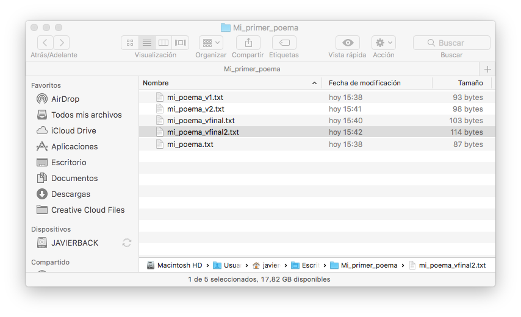
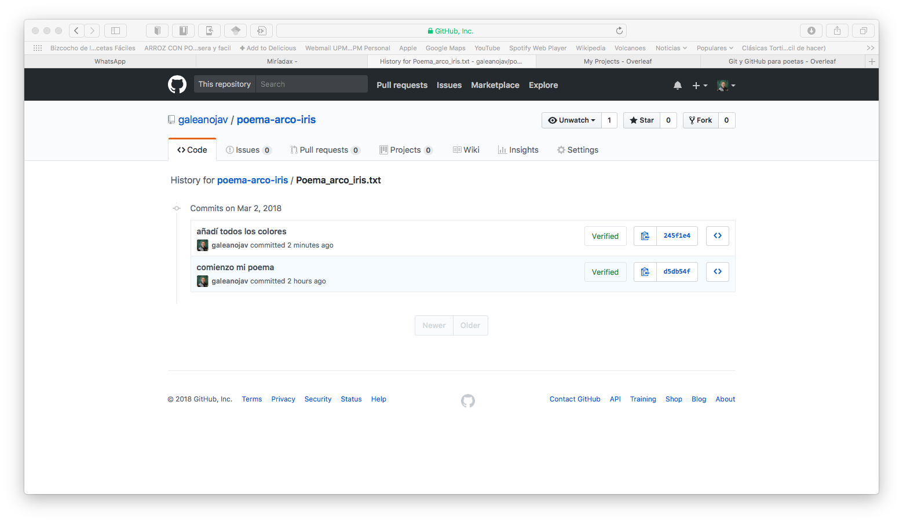
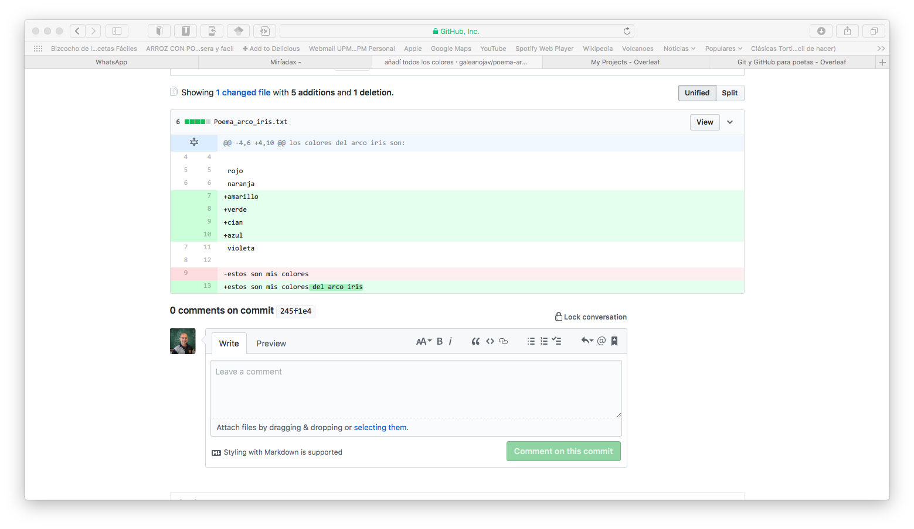

> (1) Grupo de Sistemas Complejos, ETSIAAB, Univerisdad Politécnica de Madrid.

> Autor para correspondencia:Javier Galeano [javier.galeano@upm.es]


# Palabras clave

> GitHub; Git; control de versiones ; 


# Keywords

> GitHub; Git; version control; 


```{r knitcitations, echo=FALSE, cache = FALSE}
library(knitcitations)
cleanbib()   
cite_options(citation_format = "pandoc")
```

Los estudios en ecología han pasado de ser trabajos personales, donde se dedicaba una vida de esfuerzo personal al estudio de una especie o un pequeño sistema, a realizar trabajos multidisciplinares en que involucran a un grupo de colaboradores con diferentes bagajes. En consecuencia, la cantidad de datos en un estudio típico de ecología ha aumentado exponencialmente, creciendo la necesidad de realizar programas para tratar de gestionar y modelizar todos esos datos. Además, en todos los ámbitos científicos, y en particular en ecología, se está intentando que cada investigación pueda ser reproducible hasta el más mínimo detalle (por ejemplo [@Rodr_guez_Sanchez_2016]). Con todas estas ideas el uso de herramientas de control de versiones comienza a ser imprescindible en nuestros trabajos. Con esta nota se pretende animar a los investigadores a utilizar una de las herramientas más populares en control de versiones como es GitHub. 


# ¿Necesito usar GitHub?

Para responder a esta pregunta voy a mostrarte un ejemplo. En la figura \ref{Fig1} se puede ver todas las versiones que he hecho de mi poema sobre el arco iris. A pesar de que el poema es sencillo, y probablemente sin ningún interés literario, hay bastantes versiones del poema, si esto te suele ocurrir con tus ficheros puede ser una buena idea que uses alguna herramienta de control de versiones. git es precisamente una herramienta de control de versiones que se usa en tu propio ordenador y te puede ayudar a tener controladas todas las versiones de tu poema o de tu artículo.


Por otra parte seguramente te ha tocado colaborar con mucha gente para escribir un proyecto científico, o el código de un programa donde se va haciendo el software a pedazos, cortando, pegando y probablemente sin documentarlo. Si te ha pasado todo esto, está claro que una herramienta como GitHub puede ayudarte mucho para que tu trabajo sea más fácil y eficiente. Me gustaría aclarar que hay otras herramientas similares a git y GitHub, pero yo uso éstas por dos razones: son gratuitas y tienen un uso cada vez más extenso [@Blischak16;@Perez16] . Además si Linus Torvald, el creador de Linux, creó git puede ser una buena razón para usarlo. 

Pero si todo son ventajas, ¿por qué no lo usa más gente? Yo creo que el principal problema es que la curva de aprendizaje de git y GitHub al principio es dura, y eso hace que mucha gente decida no avanzar en estas herramientas. Otro de los problemas es que se enseña a usar las dos herramientas centrándose en git, usandolo desde el terminal. Esto puede ser bastante duro si no tienes demasiada experiencia desde un terminal en Windows o Mac. Para resolver este último problema, algunas autores proponen comenzar aprendiendo a usar GitHub, que aunque está basado en git, como entorno puede ser bastante más fácil y amigable ( [videotutoriales de Github](https://www.youtube.com/playlist?list=PLRqwX-V7Uu6ZF9C0YMKuns9sLDzK6zoiV) ).

# Diez pasos para comenzar a usar GitHub

Estos diez pasos son una guía sencilla que explican las acciones básicas para iniciarnos en el uso de GitHub. El paso 0 debería ser hacerse una cuenta en GitHub, pero como eso es bastante sencillo, vamos a suponer que ya tenemos esa cuenta.

1. **Paso 1. Primer Repositorio** Entramos en nuestra cuenta de GitHub y nos vamos a la pestaña de repositorios, Repositories en inglés. En la pestaña que pone **New**, damos un click para crear nuestro primer repositorio, que suele abreviarse en repo, en GitHub. 
Lo primero que tenemos que hacer es poner el nombre del repositorio, en este caso *poema arco iris*, pero veremos que a GitHub no le gustan los espacios así que me lo renombrará a *poema-arco-iris*. Añadimos una descripción, que no es obligatoria, para conocer el contenido de mi repositorio *Mi poema sobre el arco iris*. El repositorio tendrá un caracter público, podéis ver que está activo el botón de *Public* y además le decimos que al crear el repositorio añada un fichero *Readme*. Por favor, añade este fichero, de no hacerlo luego se complica todo mucho más. En este fichero que aparecerá como presentación de lo que hay en nuestro repositorio, por defecto se copiará el título del repo y debajo la descripción que hemos añadido. Si queremos añadir más contenido podemos editarlo posteriormente. Por último hay dos pestañas que nos piden añadir dos ficheros: .gitignore y license. De momento vamos a dejarlo en **None** y ya veremos más adelante qué tipos de ficheros son y para qué nos sirven. Es por tanto el momento de darle al botón **Create repository**. Tendremos nuestro primer repositorio con el fichero README.md que pone el título y la descripción del repo.

2. **Paso 2. Primer fichero, el poema del Arco Iris** Usemos nuestro repositorio para escribir directamente aquí nuestro primer fichero, el poema. Clicamos en el botón para crear un fichero nuevo, **Create new file** y aparecerá un sencillo editor donde podemos escribir nuestro primer texto. En la parte superior le ponemos el título del fichero, *poema_arco_iris.txt*. En nuestro caso el fichero será de tipo txt, que es uno de los tipos de ficheros que GitHub puede gestionar sin problemas. Nuestro texto es un poema sobre el arco iris y sus colores. Querríamos dejarlo de momento grabado para seguir más tarde. En git y en GitHub el equivalente a grabar un fichero podríamos decir que se llama **commit**. Si bajamos en la página podremos ver un botón que se llama **Commit new file**. Inicialmente está deshabilitado, pero si escribimos en el campo que está debajo del título **Commit new file**, el botón se activará y se marca el botón de **commit directly to the master branch**. Ya hablaremos de lo que son las *branch*, pero de momento no toquemos nada. En este campo vamos a escribir una pequeña referencia de lo que hemos escrito, por ejemplo `Comienzo el poema`. Con esto ya estaríamos listos para crear nuestro primer commit. Una vez creado, volvemos automáticamente a la carpeta de repositorio. Tenemos un nuevo fichero en la lista, `poema_arco_iris.txt`, y además debajo del título aparece que ya tenemos dos commits. Debajo del botón donde pone master, sale el nombre de nuestra cuenta, el texto del último commit y si en esa línea seguimos a la derecha pone *Last commit* y un montón de letras y números. Git usa un identificador que es un número hexadecimal de 40 dígitos generado como clave de hash SHA1, es decir, cada commit tiene un indentificador único. Como os podéis imaginar no se suele llamar al commit por su identificador largo, pero sí  que hay una versión corta del indentificador con los 7-8 dígitos iniciales (\ref{Fig2}).

3. **Paso 3. Veamos la historia** Después de visitar Wikipedia, nos volvió la inspiración de todos los colores que componen el arco iris, así que nos fuimos al fichero, lo editamos de nuevo, esta vez añadiendo todos los colores que faltaban, y para terminar, cambiamos la frase final. Por supuesto para que quede grabado hacemos un nuevo commit, diciendo que añadimos todos los colores. Con el fichero del poema abierto, nos fijamos en la parte derecha veremos un botón que pone **History**, si clicamos aparece la lista de todos los commits. Vemos que en este caso hay dos commits, y si miramos a la derecha nos sale su hash abreviado, es decir, su identificador único. Es probable que hasta ahora no nos hayamos dado cuenta de la ventaja de GitHub, pero ahora al ver todas las versiones listadas de nuestro fichero, sin esos titulos de ficheros de primera version, segunda version, versión final, ... . Todas las versiónes están aquí recogidas y organizadas en una lista. Pero esto no es lo mejor, si hacemos click en el último commit nos va a aparecer una imagen donde se nos va a marcar en verde lo que hemos añadido con un signo + delante de la línea, en nuestro caso la lista de los nuevos colores que añadimos. En rojo nos marca la línea que hemos modificado y en verde claro lo que ya estaba y en verde más oscuro lo que añadimos al final de la frase. Tenemos todos los cambios hechos en la versión y marcados con colores (\ref{Fig3}). 

4. **Paso 4. .gitignore y license** Cuando creamos el primer repositorio añadimos el fichero *readme.rmd*. Este fichero hace que el repositorio sea más fácil de usar y que, de una manera sencilla, veamos de qué va el repositorio. Pero justo debajo teníamos dos botones que ignoramos: **Add .gitignore** y **Add a license**. GitHub nos hace la vida más fácil pudiendo añadir esos dos ficheros. El botón de license, nos añade un fichero con la licencia de tipo creative commons para que la comunidad pueda usar esos ficheros libremente pero con las restricciones típicas. Cada uno puede estudiar el tipo de licencia que quiere usar. El botón de **.gitignore** puede sernos más útil. Supongamos que trabajamos en un lenguaje de programación, por ejemplo Python. Podemos añadir un fichero .gitignore para la programación en python. Lo que va a hacer ese fichero es dicerle a git cuales son los ficheros que no hace falta que trabaje con ellos. Los motivos son muchos, pero si uno trabaja por ejemplo con Jupyter el programa hace copias automáticas de los programas para que no se pierdan los cambios, pero nosotros no queremos que estén en nuestro repositorio de GitHub, pues si tenemos esos ficheros en nuestro.gitignore cuando hagamos un commit o cualquier otro proceso no buscará esos ficheros.

5. **Paso 5. Creando una nueva rama** Tenemos nuestro repositorio donde hemos ido haciendo cambios en el fichero del poema de arco iris. Pero queremos hacer una prueba experimental que no sabemos si funcionará, es el momento de hacer una nueva rama. Si nos situamos en el repositorio **poema-arco-iris**, podemos ver un botón en el que pone **Branch:master**. Por defecto la rama principal se conoce como master, que es donde hemos ido trabajando, pero queremos trabajar en una nueva rama. Clicamos en el botón y aparecerá un campo que pone **create o find a new branch**. En mi nueva rama voy a explorar la posibilidad de introducir nuevos animales mitológicos en el poema así que lo llamaré `mitos`. Una vez que escribimos el nombre, aparecerá un botón que pone **create new branch** y clicamos. Parece que nada ha cambiado en nuestro repositorio, pero si nos volvemos a fijar en el botón de branch ahora pone **Branch:mitos**. Voy a añadir a el poema un par de mitos, este caso el basajaun y la basandere. Edito el fichero del `poema_arco_iris.txt` y añado al basajaun y la basandere al final de los colores. Para que la variación se guarde tengo que hacer el commit, y vemos que está activado el botón  **commit directly to the mitos branch**. Por tanto estoy añadiendo mi modificación sobre la rama de mitos y no sobre la rama master. Creo el commit y volvemos a la página del repositorio. Ha aparecido un nuevo botón que pone **compare & pull request**.

6. **Paso 6. Compare & and pull request** Antes de trabajar con el nuevo botón, veamos qué  ha pasado con este repositorio y la nueva rama. Para ello en la parte superior vemos un botón de **insights**, entramos y aparece una columna a la izquierda donde vemos **network**. Entrando veremos que hay una línea horizontal negra, con la etiqueta *master* y por debajo le ha salido una flecha que ha avanzado y que pone *mitos*. Son las dos ramas que tenemos ahora en nuestro repositorio vistas de una manera gráfica. Volvamos a la página principal del repositorio. Allí sigue nuestro nuevo botón **compare and pull request** y el botón de branch ha vuelto a ponerse sobre master, **Branch: master**. Si nos fijamos en el fichero del poema, como estamos en la rama master, no aparecen los cambios que hemos hecho en el poema, ya que esos cambios están en la rama mitos. Supongamos que me gusta como ha quedado el nuevo poema añadiendo estos dos mitos vascos y los quiero juntar a la rama master, que es donde se supone que dejamos los ficheros principales. Es el momento de clicar en **compare & pull request**. Me sale una ventana nuevo **open pull request** ya que estamos solicitando que los cambios se añadan a master. Rellenamos títulos y los campos necesarios y le damos a **create pull request**. GitHub, mira a ver si hay algún problema a la hora de juntar los dos ficheros, y en nuestro caso nos pone que no hay ningún conflicto **This branch has no conflicts with the base branch**. Así que le damos al botón **merge pull request**, nos pide que lo confirmemos, y cuando lo hacemos nos da la posibilidad de borrar la rama de mitos. En este caso no lo voy a hacer para que veamos gráficamente que ha pasado. Volvemos de nuevo a **network** y ahora vemos que la rama *mitos* y la rama *master* se han juntado en un punto. Hemos trabajado con nuestro primera rama. 

7. **Paso 7. Fork** Es el momento de pasearnos por GitHub y buscar algún repositorio que nos interese. Supongamos que lo encontramos y queremos hacer una copia de dicho trabajo para trabajar con él. En la parte derecha superior veremos un botón de **Fork**. Lo que vamos a tener es un repositorio igual a este que nos ha gustado pero en nuestra cuenta de GitHub, así podremos tarabajar con él e incluso ayudar a un desarrollo colaborativo del proyecto. 

8. **Paso 8. Pull request** Supongamos que el repostirio que hemos copiado con *Fork* es un código colaborativo sobre el que estamos trabajando con nuestros colegas. Encontramos algo que fuinciona mal o que pensamos que podemos mejorar y hacemos el cambio en nuestro repositorio. Pensamos que por tanto podría ser interesante enviarlo al repositorio original, pero nosotros no tenemos los permisos para poder hacerlo, así que lo que hacemos es pedir un **Pull request**. El proceso es similar a lo que hicimos nosotros en el paso 6, lo único es que esta vez tiene que ser el propietario original del repositorio. Es esta la base de trabajo en un proyecto colaborativo.

9. **Paso 9. Intro a linea de comandos: git** La herramienta GitHub tiene como columna vertebral, git. Git es la herramienta de control de versiones que se creó para trabajar en línea de comandos para el desarrollo de Linux. Está pensada para trabajar en este entorno, pero puede usarse en otros sistemas operativos como Windows o MacOs. En MacOs, ya que su nucleo central está desarrollado en unix, basta con abrir un terminal y poner git. En Windows es algo más complejo y hay que instalar un pequeño programa llamado git bash. Antes de comenzar a trabajar con git en local, tenemos que pensar que estamos en un sistema operativo de Unix/Linux y por tanto necesitaremos algunos comandos de Unix que nos permitan hacer algunas trabajos sencillos como cambiar de directorio, listar los archivos en un directorio y pocas cosas más (Tabla 1). Pero, ¿ por qué necesitamos usar git? Supongamos que os he convencido de que es interesante usar un control de versiones, la mayoría de las veces estamos trabajando en local en nuestro ordenador, y una vez realizados los cambios querremos subir a GitHub nuestros cambios. Tenemos que hacer por tanto lo que ya hemos aprendido desde GitHub, por ejemplo hacer un commit, pero en local. Lo primero que tenemos que hacer es configurar nuestro git de tal manera que sea fácil conectarlo con nuestro GitHub y el flujo de trabajo sea muy fácil. Lo primero que tenemos que hacer es conectar nuestro git local con nuestra cuenta de GitHub, para ello basta con escribir en el terminal dos comandos bastante sencillos:
  
  `git config --global user.name "User Name"`

  `git config --global user.emal email_usado_en_GitHub`

  y para ver si esto ha funcionado, escribimos `git config --list` y deberíamos ver nuestro nombre y el email.

10. **Paso 10. Clonar un Repo, push and pull** Partimos de que tenemos ya git instalado y ahora queremos trabajar en nuestro repositorio en local para luego subirlo a GitHub. Lo primero que recomiendo es crear un directorio donde pueden estar nuestros proyectos de GitHub, así podemos tener todo organizado. Abrimos nuestro terminal, nos vamos al directorio donde queremos poner nuestro repositorio. Ahora tenemos que clonar el repositorio que tenemos en GitHub para poder empezar a trabajar en local. Lo primero que podemos hacer es ir a nuestro repositorio en GitHub, por ejemplo a **poema-arco-iris**. Allí veremos un botón que pone **clone or download**, si hacemos click aparece la direccción https de nuestro repositorio, copiemos esa dirección, nos vamos al terminal y escribimos, `git clone dirección_url` en mi caso, `git clone https://github.com/galeanojav/poema-arco-iris.git`. Ese será el paso para clonar el repositorio entero en mi directorio local, que se acaba de convertir en un repositorio. Nos metemos en el directorio con `cd poema-arco-iris` y ya podemos ver lo que hay dentro del repositorio con `ls`. Editemos ahora nuestro poema.txt con cualquier editor y grabamos el cambio. Si escribimos en el terminal `git status` veremos que nos dice que nuestro fichero se ha modificado. Es el momento de hacer el commit para que esa modificación se guarde de verdad. Escribimos en el terminal `git commit -a -m "Primer commit en local"` y tendremos nuestro fichero cambiado y guardado con el commit. Tenemos entonces que subirlo a GitHub. Para ello vamos a usar un nuevo comando de git, **push**. Si queremos subir desde nuestro ordenador a GitHub usamos `git push` y si queremos bajar por ejemplo un cambio que se hizo en nuestro programa y que alguien subió al repositorio, necesitamos hacer `git pull`. Probemos a hacer `git push` y nuestro cambio en local del fichero de texto aparecerá en GitHub con el nuevo commit que habáimos añadido en local. 

# Apendice: GitHub en Rstudio

Un pequeño apéndice para hacer notar que todos estos pasos con los **commits**, **push** and **pull** pueden hacerse de una manera bastante sencilla e intuitiva desde *Rstudio*, que suele ser una herramienta que muchos usamos para programar en `R`. El uso de Git en Rstudio necesitaría una nota entera para contarlo, pero comenzar es sencillo. Vamos 'File -> New Project`. Aparece una ventana donde podemos elegir **Version control**, y decidir usar Git y proporcionar la url que hemos copiado en el paso 10 para clonar un repositorio. Si hacemos esto, aparecerá el repositorio y una pestaña de Git, donde apareceran los botones para hacer **commits**, **push** and **pull**. En cualquier caso hay varios tutoriales en la propia ayuda de Rstudio [Tutorial de Git y GitHub en Rstudio](https://support.rstudio.com/hc/en-us/articles/200532077?version=0.99.896&mode=desktop)

# Conclusiones

Estos diez pasos para trabajar con git y GitHub pretenden ser una pequeña guía de iniciación a estas herramientas que considero pueden ser de gran ayuda a cualquier investigador que esté diseñanado código, aunque sea el más sencillo imaginable, y quiere compartirlo con sus colaboradores. Además esta política de subir codigo y compartirlo coincide con la idea de hacer ciencia reproducible que se considera actualmente indispensable para un mejor avance científico.  


# Agradecimientos

Me gustaría agradecer a Ana Negredo por la revisión del manuscrito. Y agrader al grupo de ecoinformática de la AEET por la posibilidad de enviar esta nota y los comentarios. Esta nota está escrita con RMarkdown [@Saiz17]


###### REFERENCIAS                                         

<div id = "refs"></div>


###### TABLA 1

**Tabla 1**. Comandos Minimos de Unix necesarias para trabajar en local.

**Table 1**. Minumum commands to work in UNIX to work in local terminal. 


| comandos de Unix | Empleo                             |
| :------           | :--------------------------------:|
| `pwd`             | devuelve la ruta actual           |
| `ls`              | listar un directorio              |
| `mk nombre_dir`   | crea directorio `nombre_dir`      |     
| `cd nombre_dir`   | cambiar al directorio `nombre_dir`|
| `cd ..`           | cambiar al directorio superior    |


###### PIES DE FIGURA

**Figura 1**. Directorio de mi primer poema.  
**Figura 2**. History and commits de mi primer poema.  
**Figura 3**. Diferencias en las versiones de mi poema.  

###### FIGURE LEGENDS

**Figure 1**. Directory of my first poem.
**Figura 2**. History and commits of my first poem.  
**Figura 3**. Differences in the versions of my poem.  


###### FIGURA 1

\label{Fig1}

###### FIGURA 2




###### FIGURA 3




